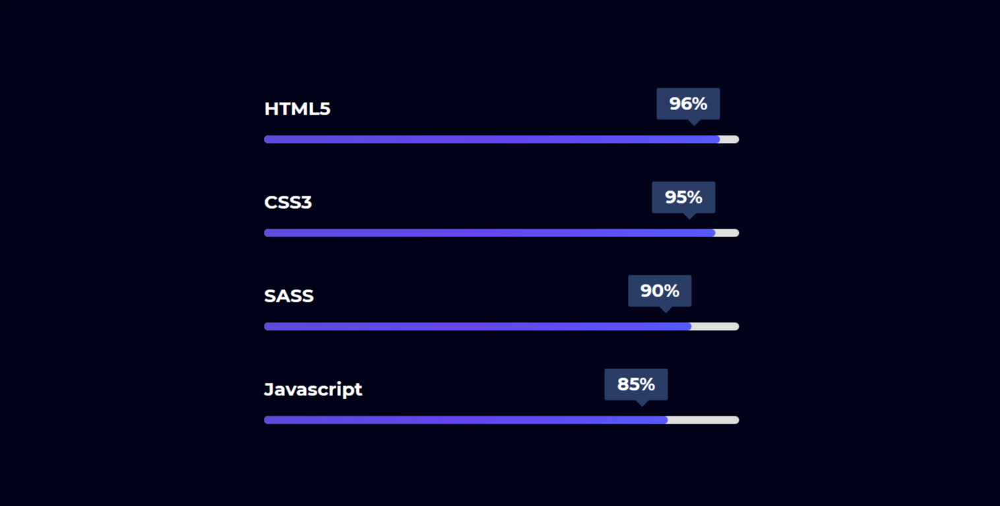

# Dynamic Horizontal Progress bar in (html css & Javascript) only:without Plugin



[▶ video-link](https://youtu.be/eFuX9b125-Y)

## Code Snippets
----------
### HTML5
```html
<!DOCTYPE html>
<html lang="en">
  <head>
    <meta charset="UTF-8" />
    <meta http-equiv="X-UA-Compatible" content="IE=edge" />
    <meta name="viewport" content="width=device-width, initial-scale=1.0" />
    <title>Progress Bar</title>
    <link rel="stylesheet" href="style.css" />
  </head>
  <body>
      <div class="progress_container">
          <div class="progress">
              <div class="progress_item">
                  <h3 class="progress_title">HTML5</h3>
                  <div class="progress_bar">
                      <div class="bar" data-value="96" data-text="96"></div>
                  </div>
              </div>
              <div class="progress_item">
                  <h3 class="progress_title">CSS3</h3>
                  <div class="progress_bar">
                      <div class="bar" data-value="95" data-text="95"></div>
                  </div>
              </div>
              <div class="progress_item">
                  <h3 class="progress_title">SASS</h3>
                  <div class="progress_bar">
                      <div class="bar" data-value="90" data-text="90"></div>
                  </div>
              </div>
              <div class="progress_item">
                  <h3 class="progress_title">Javascript</h3>
                  <div class="progress_bar">
                      <div class="bar" data-value="85" data-text="85"></div>
                  </div>
              </div>
          </div>
      </div>
    <script src="script.js"></script>
  </body>
</html>
```
### CSS3

```css
@import url('https://fonts.googleapis.com/css2?family=Montserrat:wght@400;500;700&display=swap');
* {
  margin: 0;
  padding: 0;
  box-sizing: border-box;
}
body {
  font-family: 'Montserrat', sans-serif;
  background: #020218;
}
.progress_container {
  max-width: 1140px;
  width: calc(100% - 2rem);
  padding: 0 1rem;
  margin: 0 auto;
}
.progress {
  height: 100vh;
  display: flex;
  flex-direction: column;
  gap: 1rem;
  align-items: center;
  justify-content: center;
}
.progress_item {
  padding: 0.5rem 0;
}
.progress_title {
  color: #fff;
  padding: 1rem 0;
}
.progress_bar {
  position: relative;
  width: 30rem;
  height: 8px;
  border-radius: 2rem;
  background: rgb(222, 222, 222);
}
@media (max-width: 768px) {
  .progress_bar {
    width: 25rem;
  }
}
@media (max-width: 440px) {
  .progress_bar {
    width: 300px;
  }
}
@media (max-width: 340px) {
  .progress_bar {
    width: 280px;
  }
}
.bar {
  border-radius: inherit;
  background: linear-gradient(90deg, #5b4dda, #6546ee, #575afc);
  position: absolute;
  transition: width 1.5s cubic-bezier(0.1, 0.42, 0.85, 1);
  width: 0;
  height: 100%;
  left: 0;
}
.bar::after {
  content: attr(data-text);
  position: absolute;
  right: 0;
  top: -3rem;
  width: 4rem;
  height: 2rem;
  background: rgb(41, 61, 102);
  font-size: 18px;
  line-height: 2rem;
  color: #fff;
  text-align: center;
  border-radius: 0.1rem;
  animation: text 0.6s ease-in-out;
  font-weight: bold;
}
.bar::before {
  content: ' ';
  position: absolute;
  right: 1rem;
  top: -1.2rem;
  border-left: 10px solid transparent;
  border-right: 10px solid transparent;
  border-bottom: 10px solid transparent;
  border-top: 10px solid rgb(41, 61, 102);
  animation: text 0.6s ease-in-out;
}
@keyframes text {
  0% {
    opacity: 0;
  }
  50% {
    opacity: 0;
  }
  100% {
    opacity: 1;
  }
}
```

### Javascript

```javascript
window.onload = function () {
  let bar = document.querySelectorAll('.bar');
  bar.forEach((progress) => {
    let value = progress.getAttribute('data-value');
    progress.style.width = `${value}%`;
    let count = 0;
    let progressAnimation = setInterval(() => {
      count++;
      progress.setAttribute('data-text', `${count}%`);
      if (count >= value) {
        clearInterval(progressAnimation);
      }
    }, 15);
  });
};
```